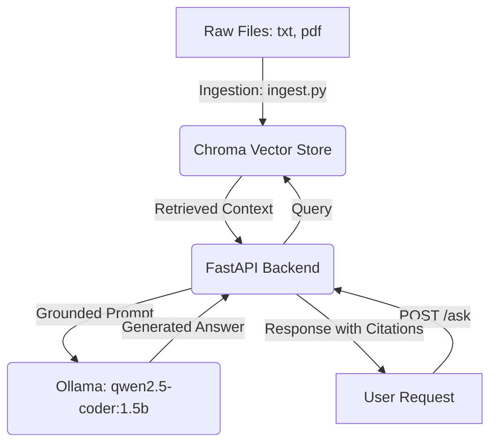

# Architecture – BelastingBuddy

BelastingBuddy is built on a modular Retrieval-Augmented Generation (RAG) architecture running entirely in a local environment.

## System Components

### 1. Ingestion Pipeline
* **Script**: [ingest.py](file:///Users/durgeshchourey/Documents/rag-project/belastingbuddy-rag/scripts/ingest.py)
* **Responsibility**: Scans for files, extracts text (using `pypdf` for PDFs), splits text into chunks, and populates the database.

### 2. Vector Database
* **Database**: ChromaDB (Persistent client)
* **Responsibility**: Indexes document chunks and matches search queries using semantic similarity.

### 3. FastAPI Web Server
* **Server**: FastAPI [main.py](file:///Users/durgeshchourey/Documents/rag-project/belastingbuddy-rag/app/main.py)
* **Endpoints**:
  * `GET /`: Health and welcome message.
  * `GET /health`: Detailed status including Chroma DB collection count.
  * `POST /ask`: Performs vector search, creates a grounded prompt, calls Ollama, and returns the generated answer alongside citations.

### 4. LLM Runtime
* **Runtime**: Ollama
* **Model**: `qwen2.5-coder:1.5b` (running locally)
